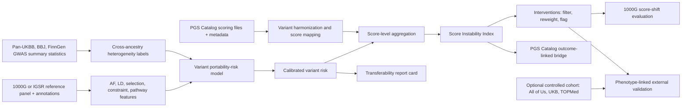
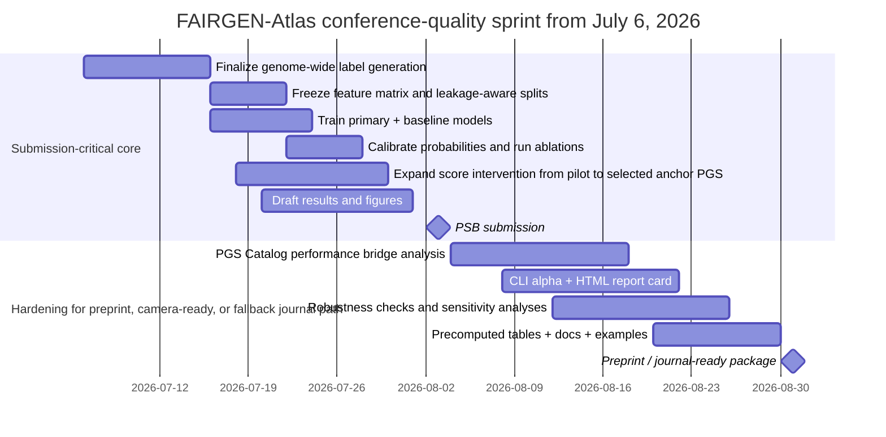
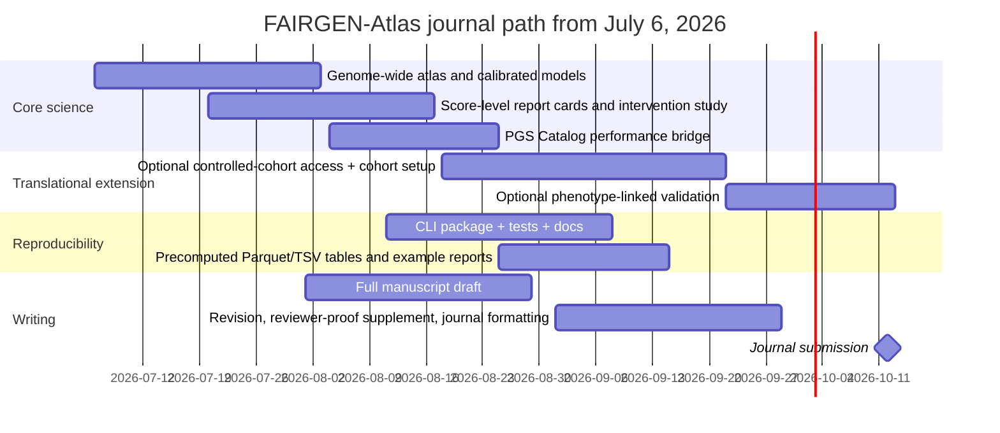

# Scaling FAIRGEN-Atlas for translational impact without overengineering

## Executive summary

Assuming you **do not currently have access to controlled, individual-level clinical genotype–phenotype cohorts**, the best way to make FAIRGEN-Atlas more novel and more translational is **not** to build a more complex representation-learning model or a heavy web platform. The shortest path is to turn the current open-data idea into a **genome-wide, calibrated, intervention-aware audit layer for existing PGS**, then add **one strong bridge evaluation** that ties your predicted instability to real score performance evidence already present in public resources. Your current proposal is already pointed in the right direction: open-data heterogeneity labels from multi-ancestry GWAS, portability-risk scoring at the variant×trait level, score-level interventions, and leakage-aware validation. The immediate need is to scale, calibrate, externalize, and package that work rather than pivot to a new architecture. fileciteturn0file0

The strongest paper version of FAIRGEN-Atlas is therefore: **a biological transferability atlas that predicts variant-level instability across ancestry contexts, aggregates those predictions into score-level instability summaries, and demonstrates that these summaries are useful for auditing, filtering, reweighting, and prioritizing external validation of published PGS**. That framing is complementary to the current PGS Catalog ecosystem, which already provides open scoring files, metadata, and some performance metrics, as well as tooling for reproducible score calculation and ancestry adjustment. citeturn4view0turn34view1turn35view0turn47view0

The minimal additions that will most improve novelty and translational credibility are these. First, scale from pilot chromosomes to a **genome-wide or near-genome-wide atlas** with strict chromosome, trait, and source holdouts. Second, make the variant-risk output **well calibrated**, because in translational settings a risk number must behave like a risk number, not just rank correctly. Third, create a **score-level instability index** and a report card for each PGS. Fourth, test whether your score-level instability summaries align with **reported cross-ancestry PGS performance in the PGS Catalog**, but only in comparably defined within-publication settings because the Catalog itself warns that performance metrics are not generally comparable across studies. Fifth, if and only if your institution already has feasible access, add **one phenotype-linked external validation** in a controlled cohort such as All of Us; otherwise keep that as the journal extension, because UK Biobank is currently paused for new applications until late 2026 and TOPMed requires dbGaP/BioData Catalyst access. citeturn48view0turn8view0turn47view1turn40view1turn47view2

That roadmap is enough to make the work competitive for a methods-focused conference or journal. For **PSB**, the bar is a sharp methods story with strong open-data evaluation and a clean tool release. For **Bioinformatics Advances**, the same package plus a reproducible CLI/report-card release is especially valuable. For **PLOS Computational Biology**, the paper gets much stronger if you add either an open outcome-linked bridge using PGS Catalog evaluation metadata or one genuinely phenotype-linked validation in a controlled cohort. The key point is that your next gains should come from **evaluation realism and deployment realism**, not from a larger model.

A useful rule for prioritization is this: if an addition does **not** improve one of the following—generalization evidence, calibration, actionability, or reproducibility—it is probably overengineering for the current paper.

| Addition | Translational value | Novelty value | Effort | Recommendation |
|---|---:|---:|---:|---|
| Genome-wide scaling with leakage-aware holdouts | Very high | High | Medium | Do now |
| Calibration and uncertainty for portability risk | High | Medium | Low | Do now |
| Score-level instability index and report cards | Very high | High | Low | Do now |
| PGS Catalog outcome-linked bridge analysis | Very high | High | Medium | Do now |
| Ancestry-normalization baseline comparison | High | Medium | Low | Do now |
| One controlled-cohort phenotype validation | Very high | Medium | High | Do if access already exists |
| Deep representation learning redesign | Unclear | Low incremental | High | Do not prioritize |
| Full web app with genotype upload | Low for paper | Low | High | Avoid for now |

## Prioritized roadmap

The right development order is still **paper first, reproducible toolkit second, lightweight web front end third**. This matches both the science and the current data-access reality. PGS Catalog already supports open downloads, harmonized files, REST access, and reproducible score calculation through `pgsc_calc`, including ancestry adjustment functionality, so the field does not need another large platform before the paper proves something new. What it does need is a **new audit concept** with strong evidence and a simple way to run it. citeturn4view0turn34view1turn47view0

The paper should be built around a compact set of deliverables. The first is a **genome-wide FAIRGEN-Atlas table** of variant portability-risk predictions for selected anchor traits. The second is a **score-level audit** that maps those risks into PGS report cards. The third is an **intervention study** showing whether risk-guided filtering or reweighting reduces ancestry-linked score instability more than strong controls. The fourth is a **translational bridge analysis** relating predicted instability to observed score portability evidence in public metadata. The tool release should then expose those same four layers through a CLI and Python package.

A sensible minimal scope is to pick **four anchor traits** with abundant PGS and summary-statistic support—such as CAD, LDL, BMI, and T2D—and do them very well before expanding outward. That is more convincing than a broad but shallow trait sweep, and it aligns with the types of traits already emphasized in your current work. fileciteturn0file0

Because **PSB 2027 paper submission is due on August 3, 2026**, the actual deadline-driven path from July 6 is only about four weeks. So the timeline below does two things at once: it shows the **submission-critical PSB track through August 3**, and it continues through the requested **8–12 week sprint** as the post-submission hardening path for a preprint, camera-ready revision, or immediate journal transfer. citeturn46view0

The longer journal path should be deliberately sequential. Do not start a large web application until the paper tables, figure set, and reproducibility artifacts are complete.

A practical deliverable map for the paper and tool is:

| Sprint output | Minimum paper artifact | Minimum tool artifact |
|---|---|---|
| Genome-wide variant risk | Main ROC/PR and calibration figures, holdout tables | `variant_portability_risk.parquet` |
| Score-level instability | Main score-shift and threshold-instability figures | `score_report.json/html/pdf` |
| Intervention evidence | Risk-guided vs random/FST-only/AF-only comparisons | `filtered.tsv`, `reweighted.tsv`, `flagged.tsv` |
| Translational bridge | Correlation/meta-regression with cataloged score performance | `catalog_bridge.tsv` |
| Reproducibility | Split manifests, configs, containers, supplement | `fairgen-atlas` CLI and Python package |

## Evaluation plan

The strongest evaluation design for FAIRGEN-Atlas is **tiered**. The first tier is **variant-level predictive validity**. The second is **score-level operational validity**. The third is **outcome-linked translational validity**, preferably first through open metadata and optionally through one secure phenotype cohort. These tiers should be kept separate in the paper so you never imply more clinical validation than you actually performed.

### Candidate datasets

| Dataset | Access status | What it is best for | What it cannot do well | Recommendation |
|---|---|---|---|---|
| 1000 Genomes / IGSR reference panel | Open | Reference AF/LD features, ancestry gradients, score-shift simulation, harmonization benchmarking | No rich clinical outcome validation; small sample for subgroup clinical claims | Essential now |
| PGS Catalog | Open | Scoring files, harmonized files, sample metadata, performance metrics, ancestry metadata | Cross-study performance comparisons need care | Essential now |
| Pan-UK Biobank summary statistics | Open | Variant×trait portability labels from multi-ancestry GWAS at scale | No direct individual-level calibration or net benefit | Essential now |
| BioBank Japan PheWeb | Open | East Asian anchor summary statistics and public phenotype-level downloads | No direct individual-level outcome validation | Essential now |
| FinnGen summary statistics | Public access via request form | European/Nordic anchor summary statistics and endpoint-rich labels | Still summary-level only | Essential now |
| UK Biobank individual-level data | Controlled; new applications paused until late 2026 | Full phenotype-linked validation if access already exists | Not realistic for PSB if you do not already have access | Journal extension only |
| TOPMed | Controlled via dbGaP/BioData Catalyst | Rich WGS, environment, clinical data; strong translational follow-up | Administrative and cloud-environment overhead | Journal extension only |
| All of Us | Controlled tier for genomics; cloud workbench | Probably the best short-list external cohort if your institution already has access | Requires institution/user approvals and secure-workbench constraints | Do only if access already exists |

The access status, scope, and current counts behind that table come from official dataset pages: IGSR supports open human variation data; the PGS Catalog currently exposes open scoring files, metadata, and harmonized files; Pan-UKBB openly releases 7,228 phenotypes across 6 ancestry groups and 16,131 GWAS; BBJ PheWeb releases full GWAS summary statistics with BBJ recruiting about 260,000 mostly Japanese participants; FinnGen DF13 publicly released 500,186 samples and 2,755 endpoints in June 2026; UK Biobank states new applications are paused until late 2026; TOPMed requires dbGaP/BioData Catalyst approval; and All of Us places genomic data in its Controlled Tier. citeturn5view3turn4view0turn34view1turn5view0turn38view0turn5view1turn39view0turn5view2turn8view0turn47view1turn40view1turn47view2

### Variant-level evaluation

This remains the scientific core of the paper. The main question is whether public population-genetic and annotation features can predict **cross-ancestry heterogeneity** of variant effects across traits. Your current proposal already uses I², direction discordance, and source inconsistency as the label foundation; that is the right base to keep. The strengthening step is to make the evaluation much harder and much cleaner. fileciteturn0file0

Use three primary holdout regimes. First, **leave-chromosome-out** or odd/even chromosome splits to rule out local genomic leakage. Second, **leave-one-trait-out** to test whether the learned biology generalizes beyond traits seen during training. Third, **leave-one-source-combination-out**—for example train without one biobank pairing or without one summary-statistics source—to show that the model is not merely memorizing cohort-specific quirks. If those three holdouts work, your novelty claim is stronger than another 0.01–0.02 AUROC point from a fancier model.

The primary reported metrics should be **AUROC, AUPRC, Brier score, calibration slope, calibration intercept, and a reliability diagram**. A portability-risk tool will eventually output probabilities or probability-like scores, so calibration has to be first-class rather than supplementary. I would report AUROC and AUPRC for ranking, and Brier plus slope/intercept for trustworthiness. Pair these with clustered confidence intervals—preferably bootstrapped by chromosome or by unique variant rather than by raw row, because variant×trait rows are not independent.

A useful secondary analysis is to move beyond a binary label and test whether the predicted score tracks a **continuous heterogeneity target**. Even if your main label is “high instability vs not,” also report the association between predicted risk deciles and observed mean I² or heterogeneity burden. This makes the model look less like a black-box classifier and more like an interpretable risk stratifier.

### Score-level evaluation

This is where the translational story becomes much stronger. A reviewer will not be satisfied by a variant-level AUROC alone if your practical claim is about published PGS portability. You need a score-level object. I recommend defining a **Score Instability Index**:

\[
\text{SII}=\frac{\sum_j |w_j|\,r_j}{\sum_j |w_j|}
\]

where \(w_j\) is the absolute effect weight of variant \(j\) in a score and \(r_j\) is FAIRGEN-Atlas portability risk. You can also report a contribution-weighted high-risk fraction, such as the proportion of total absolute score weight carried by variants above a chosen risk threshold. These two score-level summaries are easy to compute, interpretable, and directly usable in a report card.

The open-data score evaluation should answer four operational questions. How much does the score shift across ancestry contexts? How concentrated is the predicted instability in a small subset of variants? Do risk-guided modifications reduce that instability more than strong baselines? And how much of the original score structure is preserved?

| Evaluation layer | Primary question | Metrics | Data needed | Minimum for paper |
|---|---|---|---|---|
| Variant-level prediction | Can public features predict cross-ancestry heterogeneity? | AUROC, AUPRC, Brier, calibration slope/intercept, reliability plots | Multi-ancestry GWAS summaries + annotations | Required |
| Continuous heterogeneity trend | Do higher predicted risks correspond to higher observed instability burden? | Spearman/Pearson, decile plots, regression slope | Same as above | Strongly recommended |
| Score-shift stability | Does a score drift across ancestry contexts? | Mean standardized score shift, Wasserstein distance, KS statistic, variance ratio | 1000G/IGSR + PGS files | Required |
| Threshold instability | Do “high-risk” percentile assignments change across populations or interventions? | Top 1/5/10% overlap, discordance rate, reclassification tables | 1000G/IGSR + PGS files | Strongly recommended |
| Score preservation | Does intervention preserve the original score signal? | Score–score correlation, retained absolute weight mass, retained variant fraction, top-k overlap | PGS files + intervention outputs | Required |
| Open outcome-linked bridge | Do high-risk scores also show worse public portability evidence? | Within-publication metric degradation, weighted correlation, mixed-effects regression | PGS Catalog evaluation metadata | Strongly recommended |
| Phenotype-linked external validation | Does modified score retain or improve real prediction? | AUROC/AUPRC, calibration, Brier, net benefit, reclassification | Controlled cohort | Optional but high value |

For the score-shift analysis, use **z-standardized scores within the reference panel**, then report pairwise ancestry mean differences, Wasserstein distances between score distributions, and top-percentile overlap. Because many real-world uses of PRS are threshold-based, include a **threshold-instability curve** across cutoffs like top 1%, 2%, 5%, and 10%. That is more translationally legible than a single average shift.

A very important nuance: **retained predictive performance cannot be claimed from 1000G alone**, because 1000G is a reference panel and not an outcome cohort. On open data, the correct proxies are score–score correlation, retained weight mass, and preservation of ranking structure. Real predictive-performance retention needs either cataloged performance evidence or a controlled phenotype cohort.

### Outcome-linked translational evaluation

The single best open-data translational addition is to exploit the fact that the PGS Catalog stores **performance metrics, evaluation sample metadata, and ancestry information**, while also explicitly warning that these metrics are not generally comparable across studies because they depend on sample composition, phenotype definition, and modeling choices. That warning is not a problem; it tells you exactly how to do the analysis correctly. Restrict the bridge analysis to **within-publication, same-score, same-endpoint, same-metric** comparisons across evaluation sample sets where ancestry differs. Then ask whether higher FAIRGEN-Atlas score instability predicts larger public performance degradation outside the dominant development ancestry. citeturn34view1turn35view0turn48view0

The comparison can be standardized by metric family. For example, for AUC use simple differences, for OR/HR per SD use differences on the log scale, and then z-standardize within publication if needed before meta-analysis. Analyze this with a publication-level random intercept or, minimally, a weighted Spearman correlation. This one analysis creates a strong translational bridge without requiring raw phenotypes.

If you already have feasible institutional access to a controlled cohort, the best optional external validation is **one binary disease and one quantitative trait**. For example, CAD and LDL. Use a conventional base model—age, sex, principal components, and available clinical covariates if appropriate—then compare adding the original PGS versus adding the risk-guided modified PGS. Report **AUROC/AUPRC, Brier score, calibration-in-the-large, calibration slope, and decision-curve net benefit** for the disease endpoint; and **partial \(R^2\), RMSE, subgroup residual shift, and calibration slope** for the continuous trait. For this validation, use subgroup reporting by ancestry only if events are sufficient; otherwise make the pooled result primary and subgroup analyses descriptive.

For external-validation planning, size the study around **precision of calibration slope, net benefit, and thresholded metrics**, not AUC alone. Recent external-validation sample-size work emphasizes that calibration and decision-analytic precision often drive the required sample more than discrimination does, and provides formulas/software that are more appropriate than generic “events per variable” thinking. citeturn42academia0

## Translational analyses that increase novelty

The first high-yield novelty upgrade is to make FAIRGEN-Atlas output a **score-level decision object**, not just a pile of variant risks. That object should be the report card built around the Score Instability Index, weighted high-risk fraction, high-risk pathway concentration, and simulated threshold instability. Once you have that object, the paper stops being “we predicted heterogeneous variants” and becomes “we produced an actionable audit for published PGS.”

The second high-yield upgrade is to compare your biologically informed intervention against a **post hoc ancestry-normalization baseline**. This is important because the modern PGS Catalog stack already includes tooling for reproducible score calculation and genetic ancestry adjustment. If your filtering/reweighting cannot beat simple ancestry-aware normalization on score-shift reduction while preserving ranking, reviewers will ask why the intervention is needed. If it does beat that baseline—or if it reduces shift while requiring less ancestry-dependent post-processing—you have a much stronger translational claim. citeturn47view0

The third upgrade is to exploit standardized ancestry metadata in the PGS Catalog itself. Because the Catalog records ancestry composition across GWAS, development, and evaluation stages using a documented framework, you can test whether scores developed from more diverse evidence have **lower FAIRGEN-Atlas instability** or show less improvement under your interventions. That creates a clean connection between your atlas and the broader diversity/portability literature while staying entirely within open data. citeturn35view0

The fourth upgrade is a **simulated clinical workflow**, but only at the level of score auditing, not diagnosis. The workflow is: a researcher enters a PGS ID, FAIRGEN-Atlas returns a report card, the report flags high-risk variants and pathways, previews how much the score drifted across ancestry reference groups, and classifies the score into validation-priority tiers such as “relatively stable,” “needs caution,” or “high-priority for multi-ancestry external validation.” This is exactly the sort of translational narrative that helps reviewers see real-world use without forcing you into unsupported clinical claims.

The fifth upgrade, if you can afford one more analysis, is to show that your instability signal is **sparse and targetable**. You already have early evidence that risk-guided filtering or reweighting reduces ancestry-linked score shift for several scores more than random removal. Expand that across a broader score set and explicitly compare against **random, AF-only, FST-only, and LD-only** controls. If the improvement keeps appearing, you have evidence that FAIRGEN-Atlas is finding a biologically meaningful subset of portability-critical score variants rather than simply degrading scores indiscriminately. fileciteturn0file0

A compact intervention menu for the paper is enough:

| Intervention | What it does | Best current use | Claim strength today |
|---|---|---|---|
| Flag only | Leaves score unchanged, adds caution labels to high-risk variants/components | Safest translational recommendation | Strong |
| Top-q% filtering | Removes highest-risk variants or contribution mass | Demonstrates concentration of instability | Moderate |
| Linear reweighting | Downweights variants smoothly by predicted risk | Good balance of preservation and correction | Moderate |
| Exponential reweighting | Aggressive downweighting of high-risk variants | Sensitivity analysis | Exploratory |
| Ancestry normalization baseline | Residualizes or standardizes score post hoc | Essential comparator, not your main claim | Strong baseline |

My advice is to make **flag-only** the most conservative translational output in the manuscript and treat filtering/reweighting as **preclinical intervention experiments**. That will keep the paper ambitious but credible.

## Baselines, ablations, and reproducibility

A strong FAIRGEN-Atlas paper needs more than “our model beat FST.” The baselines should reflect the causal alternatives a reviewer will care about. At minimum, compare against **FST-only**, **AF-divergence-only**, **LD-divergence-only**, a simple pooled linear or logistic model, and your main nonlinear model. Then add **trait-agnostic pooled**, **per-trait**, and **trait-aware pooled** variants of the main model. If a modest trait-aware model wins without hurting leave-one-trait-out performance, that is enough modeling novelty; you do not need a deep representation-learning pivot.

The ablations should answer concrete reviewer questions. Remove selection features. Remove pathway annotations. Remove gene-constraint features. Exclude ambiguous SNPs. Restrict to unrelated 1000G individuals as a sensitivity analysis. Change the heterogeneity threshold. Restrict labels to variants with stronger evidence across multiple summary-statistic sources. Repeat score evaluations using only scores with harmonized PGS Catalog files. Because the PGS Catalog documentation explicitly notes harmonized files, build-specific versions, and flags for problematic variants, you can turn harmonization quality itself into a report-card section rather than hiding it in preprocessing. citeturn34view1

The open bridge analysis also needs its own controls. Use score-level summaries based on **mean predicted risk**, **weighted high-risk fraction**, and **pathway concentration**, then compare them to much simpler baselines such as total variant count, mean absolute weight, development-ancestry category, and raw MAF/FST summaries. If your atlas summary explains public performance degradation above those baselines, that is a central paper result.

The reproducibility package should be reviewer-ready on day one. The key artifacts are these:

| Artifact | Why it matters |
|---|---|
| Exact data manifest with versions, release dates, and hashes | Lets reviewers recreate inputs |
| Split manifests for chromosome, trait, and source holdouts | Prevents leakage disputes |
| Frozen feature schema and label definitions | Prevents moving-target methods |
| Calibration plots and calibration parameters | Makes report-card probabilities defensible |
| Full baseline/ablation result tables | Anticipates reviewer concerns |
| Precomputed variant-risk tables for released traits | Makes the tool immediately useful |
| Example HTML/PDF report cards for several PGS IDs | Demonstrates translational utility |
| CLI + Python package with tests and environment files | Makes the method executable |
| Container or lockfile | Improves portability |
| Nonclinical intended-use statement | Prevents regulatory confusion |

The official ecosystem already reinforces this packaging strategy. The PGS Catalog exposes open website/FTP/API access, processed reference panels, code on GitHub, and an Apache-licensed calculator; Pan-UKBB openly distributes results and explicitly allows reuse while prohibiting re-identification; and All of Us and other secure environments impose strict dissemination controls that make aggregate-first artifacts especially important. citeturn47view0turn38view0turn40view1

## Ethical and regulatory cautions

The cleanest ethical position is to present FAIRGEN-Atlas as a **pre-validation audit framework for published polygenic scores**. That wording is accurate, defensible, and aligned with the data you can actually access today. It also avoids promising direct clinical validity that the present study does not establish.

Avoid phrases such as **“clinical-grade,” “improves patient risk prediction,” “equitable diagnosis,” “ready for clinical deployment,”** or **“fairness-certified.”** Prefer phrases such as **“preclinical transferability audit,” “portability-risk prioritization,” “validation support,” “ancestry-linked score instability,” “research-use report card,”** and **“hypothesis-generating intervention.”** That wording matches your present evidence base, which is primarily open summary statistics, reference panels, and public score metadata rather than prospective clinical deployment.

If you later add controlled-cohort validation, keep the tool itself separate from the cohort environment. All of Us is explicit that genomic data are available only in the Controlled Tier, that direct identifiers are removed, that participant-level data cannot be redistributed, and that even small-cell aggregate reporting is restricted. Those rules argue strongly against a web tool that accepts personal genotype uploads right now. The first public release should take only a **PGS ID or scoring file**, never a patient genotype file. citeturn40view1turn47view2

The same principle applies to manuscript claims. If you only complete the open-data work, you can legitimately claim that FAIRGEN-Atlas helps identify **which PGS components appear biologically and statistically unstable across ancestry contexts before external clinical validation**. If you also complete one controlled phenotype validation, you can then say that **score auditing and selective intervention were associated with improved transport behavior in at least one real outcome setting**, but even then you should not describe the tool as a clinical decision support system without prospective validation and full regulatory consideration.

The net practical message is simple. Keep FAIRGEN-Atlas **narrow, rigorous, and obviously useful**. A paper that proves a calibrated, genome-wide, reproducible method for auditing PGS transferability—and links that audit to real public performance evidence—will be more novel and more publishable than a broader but less defensible “equitable genomics platform.”